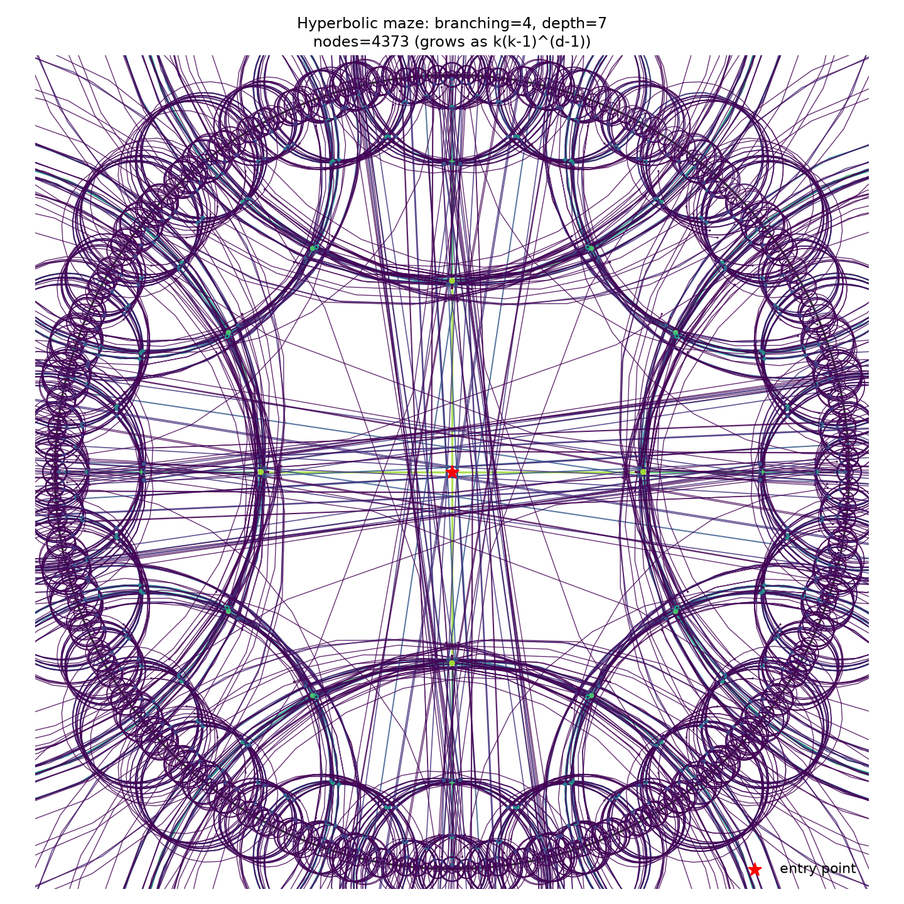

# hypermaze

**A honeypot maze embedded in hyperbolic space, hardened and network-tested, with an indistinguishable decoy layer, a provably undetectable moving-target defense, and real redundant paths.**



Most deception platforms deploy a fixed pool of decoy hosts. A patient attacker can fully map a fixed pool — deterministically, in exactly N steps, regardless of N. This project asks a narrower, more interesting question: what if the maze isn't a *fixed graph* but a *space*, generated lazily as the attacker moves through it, with geometry chosen specifically so that shifting the whole thing later leaves no detectable seam?

Every claim below is backed by a test suite, a reproducible benchmark, and — as of the latest round — a real live server that's been hardened, fuzzed, and reached over an actual WiFi network from a second physical device. Not just a diagram.

| Claim | Result |
|---|---|
| Lazy generation makes the maze unmappable | A systematic attacker fully maps a static N-node honeypot 100% of the time, in exactly N steps. A lazily-generated tree cannot be fully mapped — there is no fixed N. |
| Hyperbolic isometries make a "moving target" shift undetectable | Isometric shift: **0.00000000** mean distance-consistency error. Naive relabeling: **2.48** mean error (max **10.62**). This guarantee generalizes automatically to the redundant-path cross-links added later (still exactly 0 error). |
| Decoy sessions are statistically indistinguishable from the real one | Empirical false-positive rate under a Kolmogorov–Smirnov test: **4.6%**, against a theoretical ~5% for two samples drawn from the *same* distribution. A deliberately mismatched decoy is caught at p < 10⁻⁶, confirming the test has power. |
| The live server survives real attack-shaped conditions | 300 simultaneous connection attempts, 0 crashes (limits correctly enforced). 17 adversarial payloads (oversized input, binary garbage, injection-shaped strings, slowloris-style data), 0 unhandled exceptions. Reached and correctly exercised over a real WiFi hop from a second physical device. |
| The maze has real redundant paths, not just a bare tree | A pure tree has a cyclomatic number of exactly 0 — a real, detectable "this is fake" signature. The live server now wires local sibling rings at every expansion (fully lazy-compatible), and offline analysis on a full tree shows 1,076 independent cycles added at ~93% of the standard edge length (i.e. they look like ordinary local connections, not shortcuts). |

---

## The idea, in one paragraph

A regular tree with branching factor *k* has *k*(*k*−1)^(*d*−1) nodes at depth *d* — exponential. You cannot embed that in flat space without either distorting room sizes as you go deeper or capping the branching factor at ~6 (the largest regular flat tiling). Hyperbolic space supports a uniform tiling — every room looking identical, undistorted — at *any* branching factor, because the space itself has negative curvature. That single geometric fact underwrites two defensive properties: rooms can be generated lazily on demand (paying real compute only for what the attacker actually visits, since there is no bound to precompute against), and the entire local patch can be "moved" via a hyperbolic isometry — a transform that preserves every pairwise distance exactly, so nothing an attacker measured before the shift becomes inconsistent afterward.

Layered on top: every legitimate user session is accompanied by *N* decoy sessions built from the same latency/fingerprint distribution. Nothing is distinguishable from the outside until an anomaly detector fires. At that point the system "collapses" — if the flagged session was real, it's migrated invisibly to fresh infrastructure; if it was a decoy, it's kept alive as an instrumented tarpit.

The maze itself also isn't a bare tree: local sibling rooms are wired into small rings the moment they're created, so there's always a redundant path between recently-explored rooms — no way to tell, from a room's description alone, whether a given door leads to new territory or loops back to somewhere already seen.

---

## Architecture

```
hyperbolic_maze.py    Core engine — exact SU(1,1) Mobius-transform embedding
                       of a k-ary tree in the Poincare disk model.
moving_target.py       Isometric shift vs. naive relabeling — the
                       moving-target defense, benchmarked against itself.
decoy_layer.py         Real session + N indistinguishable decoys,
                       detection-triggered migration.
cycles.py               Offline whole-tree ring-link analysis — proves the
                       cyclomatic-number claim, not used by the live server.
local_cycles.py         The lazy-compatible version: rings a node's own
                       children together at expansion time. This is what
                       the live server actually uses.
server.py               A real, hardened asyncio TCP server exposing the
                       maze as a navigable protocol — connect with
                       `nc`/`telnet`. Connection limits, idle timeout, and
                       malformed-input handling included.
benchmark.py            Three-way comparison: static fixed-budget honeypot
                       (industry baseline) vs. lazy flat tree (isolates
                       laziness) vs. the full hyperbolic system.
tools/                  concurrency_test.py and fuzz_test.py — real attack-
                       shaped tests run against a live server instance.
tests/                  31 pytest tests covering the geometry, the
                       isometry-preservation proof, the decoy layer, and
                       both cycle-generation approaches.
```

---

## Quickstart

```bash
git clone https://github.com/vishal1601-2005/Hypermaze.git
cd Hypermaze
python3 -m venv hypermaze_env
source hypermaze_env/bin/activate
pip install -r requirements.txt

# verify the math and logic
python3 -m pytest tests/ -v          # 31 passed

# see the isometry proof
python3 moving_target.py

# see the decoy indistinguishability test
python3 test_indistinguishability.py

# run the three-way benchmark against a static-honeypot baseline
python3 benchmark.py

# see the redundant-path / cycle analysis
python3 cycles.py

# render the maze
python3 render.py

# talk to a live instance
python3 server.py &
nc 127.0.0.1 8888

# stress-test the live server yourself (needs the server running above)
python3 tools/concurrency_test.py --clients 100 --steps 30
python3 tools/fuzz_test.py
```

Once connected to the server: `look`, `go <n>`, `back`, `take <filename>`, `status`, `quit`. Door numbers include both a room's own children (new territory) and any local ring-linked siblings (a redundant path back to already-explored rooms) — there's no way to tell which is which without walking through.

---

## What the benchmark actually isolates

The interesting engineering question isn't "is this a good idea" in the abstract — it's *which part* of the idea is doing the work. The benchmark separates two effects that are easy to conflate:

**Laziness** (materializing a room only when the attacker steps into it) is the larger effect, and it has nothing to do with hyperbolic geometry specifically — any on-demand tree gets it. A static, pre-built honeypot of any size is a *finite object*; a systematic attacker maps it completely in exactly N steps, every time. A lazily-generated tree has no such N.

**Hyperbolic geometry specifically** earns its keep in one measurable place: moving-target shifts. An isometry of the Poincaré disk preserves every pairwise hyperbolic distance exactly — so if an attacker has fingerprinted relative distances between rooms (via RTT, hop count, or any consistent metric) before a shift, every one of those measurements is still exactly true afterward. There is no internal inconsistency to detect. A naive "shuffle which backend serves which address" approach has no such guarantee, and the benchmark shows it: error jumps from 0 to a mean of 2.48 (max 10.62).

**Cycles have the same honest split.** A mathematically exact regular hyperbolic tiling has cycles built in from the start, but building one exactly is a research-level graph theory problem (solving the word problem for the tiling's symmetry group). What's actually implemented is an approximation, and it comes in two forms with a real tradeoff: whole-tree ring links (`cycles.py`) are more thorough but require knowing about every sibling subtree at a depth — incompatible with staying lazy. Local sibling rings (`local_cycles.py`, what the live server actually runs) are fully computable from a single expansion event, so they preserve the laziness win, at the cost of smaller, more localized cycles.

Full breakdown — including the specific attacker models used (random walk and systematic DFS), the static-honeypot baseline, the hardening test results, and the LAN validation writeup — is in [`BENCHMARK.md`](BENCHMARK.md).

---

## Honest limitations

This is a tested, reproducible research prototype, hardened against a real (if narrow) set of conditions — not a production-ready security product.

- No auth or TLS. Connection limits, idle timeouts, and malformed-input handling are in place (see hardening results in `BENCHMARK.md`), but there's no integration with a real IDS, SDN controller, or session-migration fabric.
- Validated over a real LAN hop from a second physical device, but never exposed to the open internet — a fundamentally different threat model (background-radiation scanning, no assumption of a trusted local network).
- The attacker models used throughout (random walk, systematic DFS) are the ones we could rigorously define and test. A real adversary may have strategies — timing side-channels, protocol fingerprinting — this repo doesn't simulate.
- The decoy/migration layer is a clean simulation of the logic (session objects, timing distributions). Wiring it into real infrastructure is a separate, substantial engineering project.
- Not independently red-teamed — everyone who has tried to break this so far also helped build it.

If you're picking this up for a real deployment, treat the maze-containment, moving-target, and decoy pieces as a candidate architecture to integrate into an existing deception platform, not a drop-in replacement for one.

---

## License

MIT — see [LICENSE](LICENSE).
